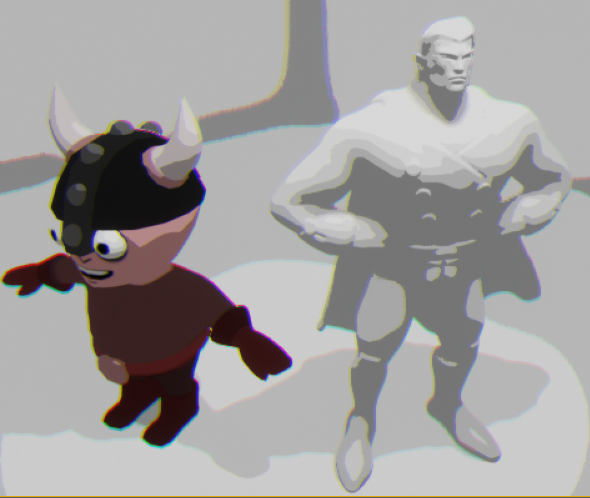
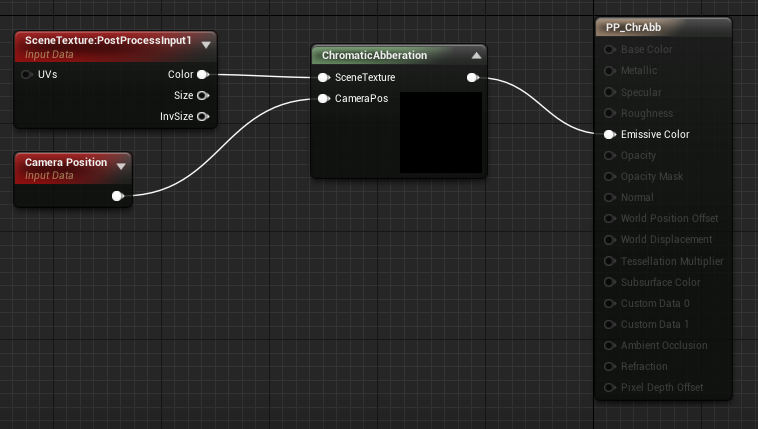
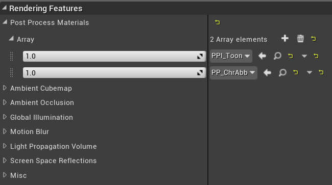
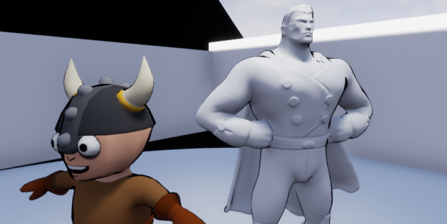
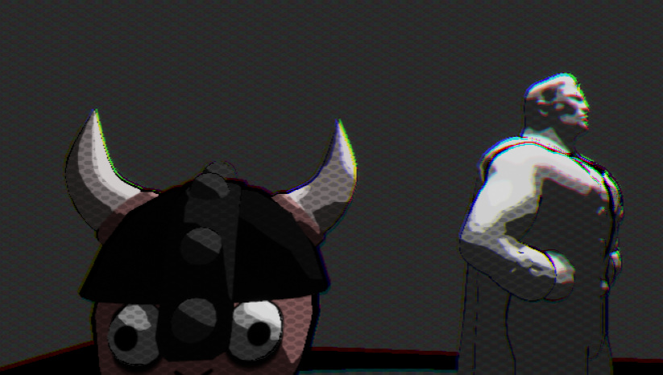
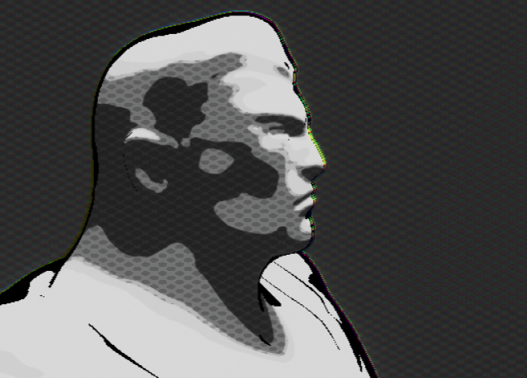

# Spiderverse-Styled-Rendering

## Alpha Progress:

So far two main features have been fully implemented -- Toon Shading and Chromatic Abberation!  The Toon Shading has 5 bands of color and differentiates based on the original color's luminance.  The Chromatic Abberation scales to be more intense the further away the camera is from an object.

These post process effects are done as separate shaders in Unreal, implemented as Unreal Materials.  GLSL code, in Unreal Engine read as a .usf file, can be linked to a node in Unreal's Blueprints to make this post process material:

These separate shaders can be ran one-by-one in an array within a Post Process Volume instance in the scene:

The next steps are finishing outline drawing, smearing effects, and comic book style textures!

## Beta Progress

Now includes Ben-Day textures and outlining!

Currently, outlining involves coloring in outlines when the dot product between the camera vector and the geometry's surface normal is underneath a particular value.  This creates a decent outline, but it is not ideal as the line quality can be a bit inconsistent and doesn't scale nicely when zoomed out from an object.  Next steps are to try using a depth channel to further tune the outline drawing, and perhaps look into silhouette rendering.

Ben-day Dot texturing is done by generating a grid of an adjustable size and drawing dots within the grid cells.  These dots shade the image with a darker tone from the original image to create the impression of the iconic comic book dots.  The dots' radii increase within darker tones, and eventually do not appear in the lightest tones of the image.  It also happens to pair very well with the outlining!

## Resources
